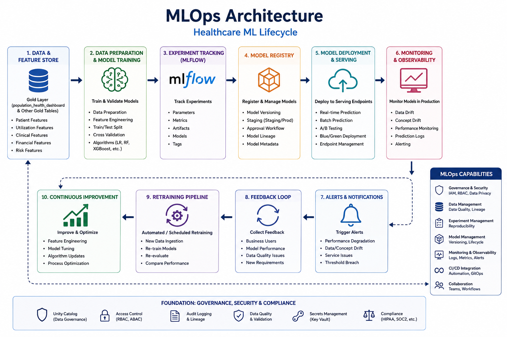

# MLOps Architecture



---

Feature Store → Training → Registry → Serving → Monitoring

```text
Feature Store
↓
Training
↓
MLflow
↓
Model Registry
↓
Serving Endpoint
↓
Monitoring
↓
Retraining
```

Planned:

- drift monitoring
- inference logging
- CI/CD
