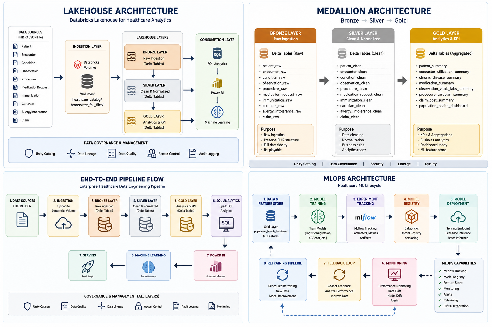

# Architecture Overview




This project implements an enterprise healthcare analytics platform using Databricks Lakehouse Architecture.

Architecture Layers:

```text
FHIR JSON
↓
Bronze
↓
Silver
↓
Gold
↓
SQL Analytics
↓
Power BI
↓
Machine Learning
```

Purpose:

- scalable healthcare ETL
- analytics engineering
- healthcare reporting
- ML feature engineering
