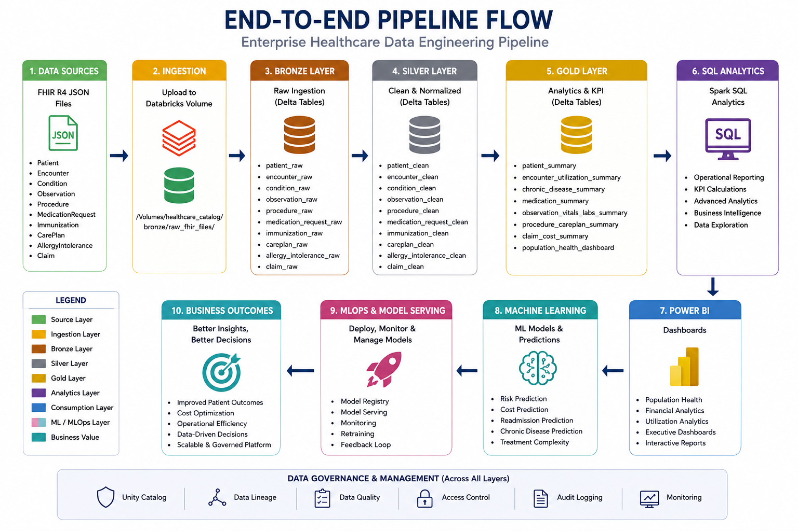

# End-to-End Pipeline

---

FHIR → Bronze → Silver → Gold → SQL → BI → ML

Execution Order:

Phase 1

Upload FHIR
→ Bronze

Phase 2

Bronze
→ Silver

Phase 3

Silver
→ Gold

Phase 4

Gold
→ SQL Analytics

Phase 5

SQL
→ Power BI

Phase 6

Gold
→ ML
