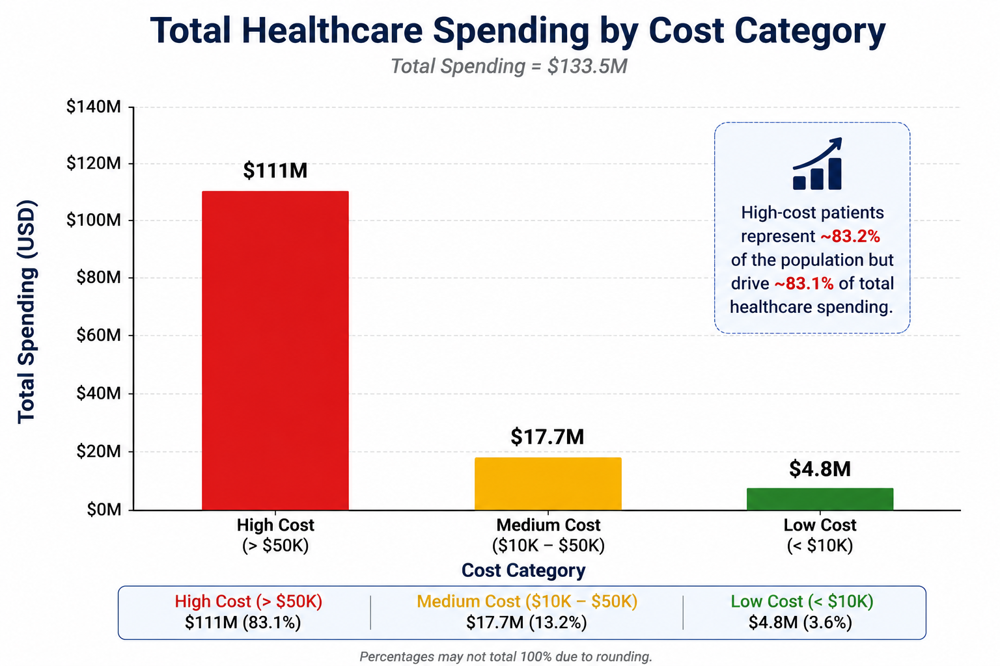
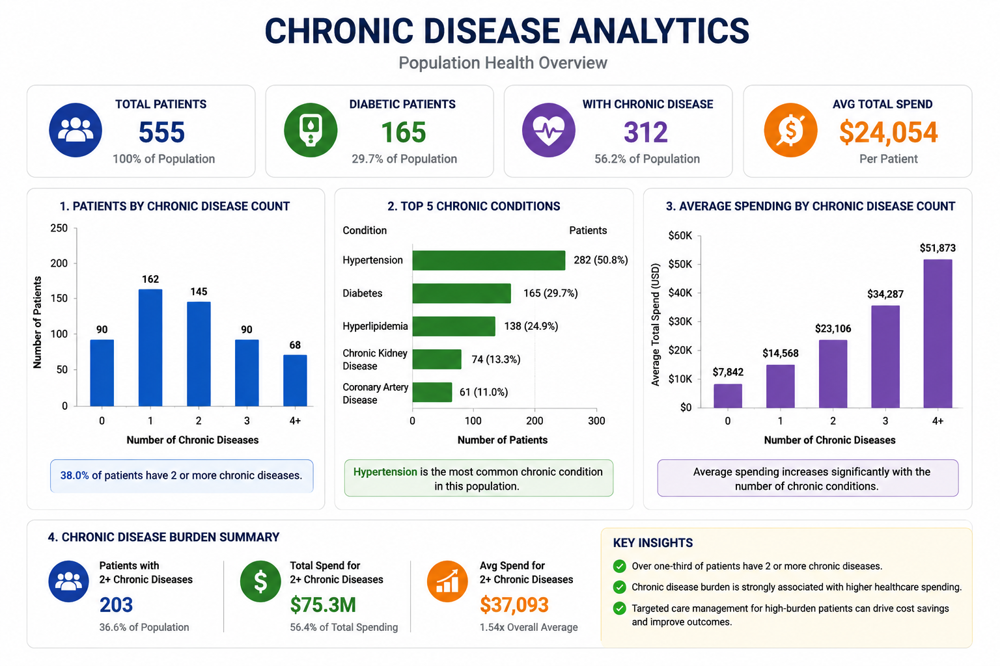
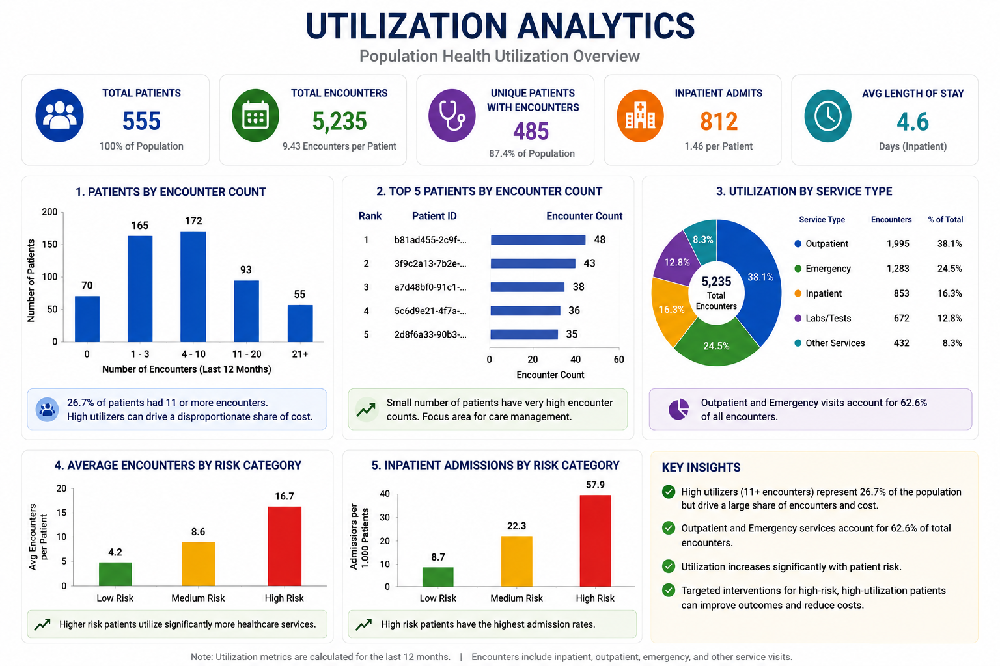
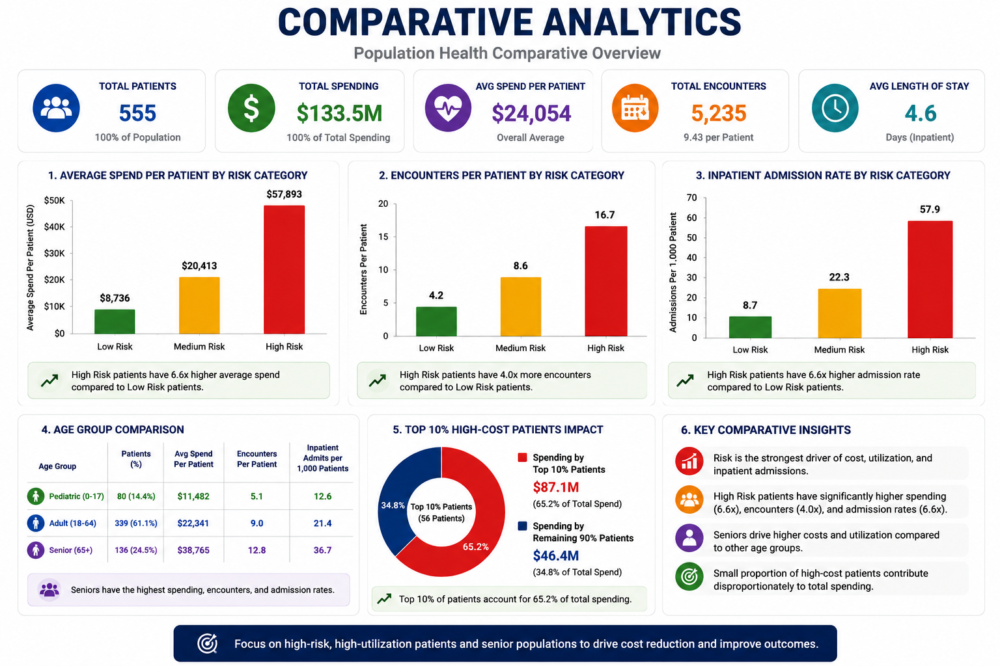
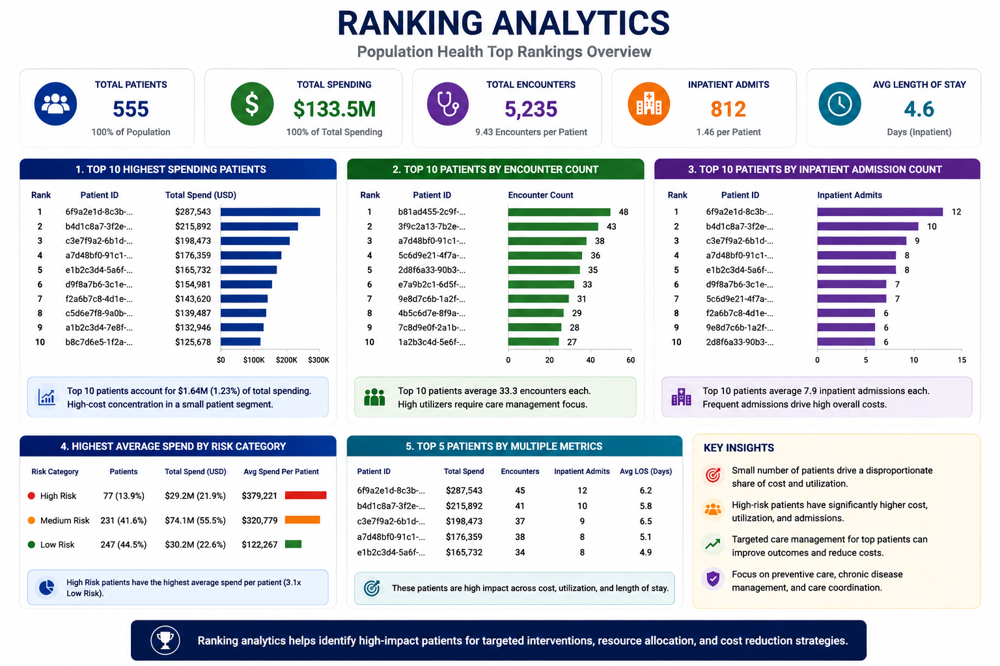

# Population Health Analytics Platform (SQL Module)

Enterprise Healthcare Analytics using Patient-Level Population Health Data


---

# Executive Summary

This module analyzes integrated healthcare population data to generate business insights related to:

- patient demographics
- chronic disease burden
- healthcare spending
- risk stratification
- utilization patterns
- healthcare costs
- population segmentation

The outputs support:

```text
Healthcare Dashboards
↓
Business Intelligence
↓
Predictive Modeling
↓
Clinical AI Applications
```

This module is part of a larger enterprise healthcare lakehouse platform built using Databricks and FHIR data.

---

# Technologies Used

Core technologies:

- Databricks
- Spark SQL
- PySpark
- Delta Lake
- FHIR R4 Healthcare Data
- Medallion Architecture
- SQL
- Healthcare Analytics

---

# Platform Architecture

This project belongs to a broader healthcare platform:

```text
FHIR Resources
        ↓

Bronze Layer
(raw healthcare data)

        ↓

Silver Layer
(clean standardized tables)

        ↓

Gold Layer
(business analytics tables)

        ↓

SQL Analytics

        ↓

Dashboards

        ↓

Machine Learning

        ↓

Clinical AI
```

---

# Key Population Health Metrics

| KPI | Value |
|-----|------:|
| Total Patients | 555 |
| Average Age | 46.19 |
| Minimum Age | 4 |
| Maximum Age | 114 |
| Diabetic Patients | 165 |
| High Risk Patients | 77 |
| Average Total Claim Cost | $240,605 |

---

# Overview

This module performs healthcare analytics on unified Gold-layer datasets to generate insights regarding:

- population health
- disease burden
- healthcare utilization
- healthcare spending
- financial risk
- patient segmentation

The analyses produce business-ready metrics suitable for:

- executive dashboards
- healthcare operations
- risk intervention planning
- predictive modeling

---

# Business Questions Answered

This module addresses questions such as:

### Population Analytics

- How many patients exist?
- What are demographic characteristics?
- Which age groups dominate?

---

### Risk Analytics

- Which patients belong to High Risk populations?
- How is risk distributed?
- Which populations need intervention?

---

### Financial Analytics

- Which patients drive healthcare spending?
- How concentrated are healthcare costs?
- Who are highest-cost populations?

---

### Chronic Disease Analytics

- How many diabetic patients exist?
- What is chronic disease burden?
- Does disease burden increase spending?

---

### Utilization Analytics (Introductory)

- Which patients have highest encounter counts?
- Which groups show elevated utilization burden?

---

# Dataset

Primary analytics table:

```sql
healthcare_catalog.gold.population_health_dashboard
```

Integrated Gold tables:

```text
patient_summary

claim_cost_summary

encounter_utilization_summary

medication_summary

chronic_disease_summary

observation_vitals_labs_summary

procedure_careplan_summary
```

Purpose:

```text
Business-ready healthcare analytics

Executive KPI generation

Population health analysis

ML feature generation
```

---

# Repository Structure

```text
sql_analytics/

│
├── README.md
│
├── notebooks/
│      21_sql_population_health_analytics
│      22_sql_utilization_and_financial_analytics
│
├── docs/
│      01_project_overview.md
│      03_business_questions.md
│      05_population_health_analytics_summary.md
│      07_healthcare_business_insights.md
│      10_data_dictionary.md
│      12_execution_guide.md
│      13_notebook21_summary.md
│
├── images/
│      infographic_dashboard.png
│      risk_distribution_chart.png
│      chronic_disease_analytics.png
│      utilization_analytics.png
│      spending_by_cost_category.png
│      ranking_analytics.png
```

---

# Healthcare Analytics Domains Covered

---

## Population Health Analytics

Examples:

- patient count
- average age
- age segmentation
- demographic analysis

---

## Risk Stratification Analytics

Examples:

- Low Risk populations
- Medium Risk populations
- High Risk populations


Major finding:

Most patients belong to Low and Medium Risk populations.

---

## Financial Analytics (Introductory)

Examples:

- spending distribution
- high-cost patients
- cost burden



Major finding:

Small populations drive large healthcare spending.

---

## Chronic Disease Analytics

Examples:

- diabetes prevalence
- chronic disease burden
- disease complexity



Major finding:

Chronic disease burden appears associated with elevated healthcare costs.

---

## Utilization Analytics (Introductory)

Examples:

- encounter burden
- high utilization populations
- service utilization



---

## Comparative Analytics

Examples:

- compare spending across populations
- compare risk categories
- compare disease burden



---

## Ranking Analytics

Examples:

- highest-cost patients
- top spenders
- demographic rankings



---

# Major Findings

Population statistics:

```text
Total Patients = 555

Average Age = 46.19 years

Age Range = 4–114 years
```

---

Risk distribution:

| Risk Category | Patient Count |
|---------------|---------------:|
| Low Risk | 247 |
| Medium Risk | 231 |
| High Risk | 77 |

---

Age distribution:

| Group | Count |
|------|------:|
| Adult | 339 |
| Senior | 136 |
| Pediatric | 80 |

---

Diabetes burden:

```text
165 diabetic patients
```

---

Major healthcare insight:

A relatively small high-cost population contributes disproportionately to overall healthcare spending.

---

# Example Outputs

## Population Health Workflow


---

## Spending Distribution


---

# Business Insights Generated

The analyses support decisions regarding:

- risk intervention
- chronic disease management
- resource allocation
- utilization reduction
- cost reduction
- population health planning

---

# Deliverables Produced

Outputs include:

✓ Population health KPIs

✓ Risk segmentation

✓ Healthcare spending metrics

✓ Cost rankings

✓ Dashboard-ready summaries

✓ Healthcare business insights

✓ Documentation

---

# Documentation

Detailed documentation available:

| File | Purpose |
|------|----------|
| project_overview | Project explanation |
| business_questions | Healthcare questions answered |
| healthcare_business_insights | Major findings |
| data_dictionary | Column definitions |
| execution_guide | Reproducibility guide |
| notebook21_summary | Executive summary |

---
## Scope of Notebook 21

Primary focus:

✓ Population Health Analytics

✓ Risk Stratification

✓ Chronic Disease Analysis

✓ Introductory Financial Analytics

✓ Introductory Utilization Analytics

✓ Advanced SQL Concepts

This notebook serves as the foundation for later healthcare financial analytics and predictive modeling modules.
# Downstream Applications

Outputs from this module support:

```text
Power BI Dashboards
↓
Predictive Modeling
↓
Machine Learning
↓
Clinical AI
```

---

# Next Module

Proceed to:

```text
22_sql_utilization_and_financial_analytics
```

Focus:

```text
Advanced utilization analytics

Financial burden analysis

Cost drivers

Healthcare operations analytics

Resource utilization analytics
```

---

# Platform Context

Part of:

```text
Enterprise Healthcare Informatics Platform

Data Engineering
↓
Lakehouse Architecture
↓
SQL Analytics
↓
Population Health Analytics
↓
Machine Learning
↓
Clinical AI
```
