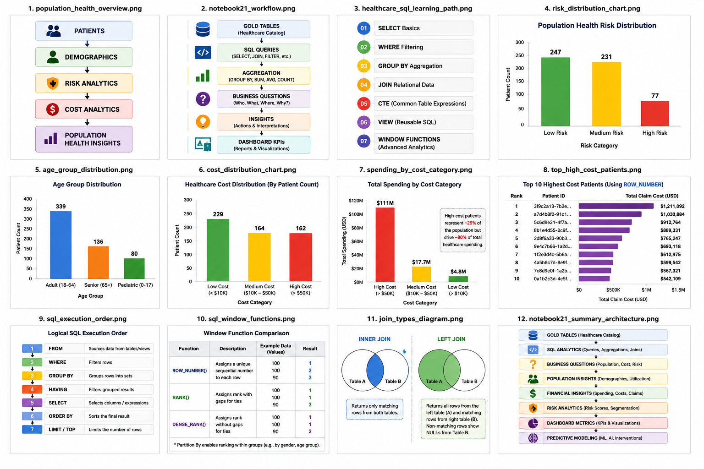
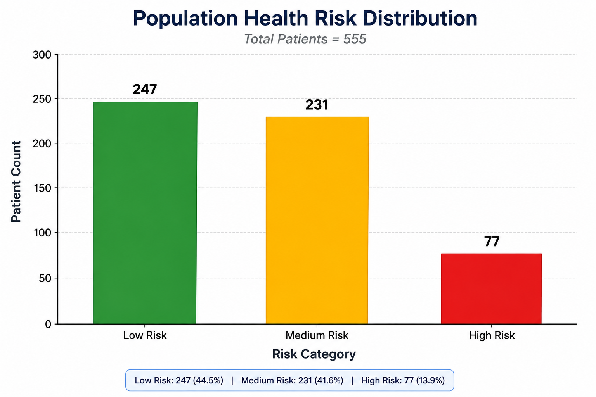

# SQL Population Health Analytics

Enterprise Healthcare SQL Analytics using Population Health Data





# Overview

This module performs healthcare analytics on a unified population health dataset to generate insights related to:

- patient demographics
- chronic disease burden
- healthcare utilization
- healthcare spending
- risk stratification
- financial analytics
- population segmentation

The analyses produce business-ready metrics suitable for dashboard reporting, healthcare operations, and downstream predictive modeling.

---

# Project Objectives

The module addresses healthcare questions such as:

### Population Analytics

- How large is the patient population?
- What are demographic characteristics?
- What age groups dominate?

---

### Risk Analytics

- Which patients belong to High Risk populations?
- What is risk distribution across the population?
- Which demographics show elevated risk?

---

### Financial Analytics

- Which patients drive healthcare spending?
- How concentrated are healthcare costs?
- Which groups contribute most to total spending?

---

### Chronic Disease Analytics

- What is chronic disease burden?
- How many diabetic patients exist?
- How does disease burden relate to spending?

---

### Utilization Analytics

- Which patients have highest encounter counts?
- Which populations show elevated healthcare utilization?

---

# Dataset

Primary table:

```sql
healthcare_catalog.gold.population_health_dashboard
```

Integrated sources include:

```text
patient_summary
claim_cost_summary
encounter_utilization_summary
medication_summary
chronic_disease_summary
observation_vitals_labs_summary
procedure_careplan_summary
```

The Gold layer provides patient-level business-ready analytics data.

---

# Repository Structure

```text
sql_analytics/

│
├── README.md
│
├── notebooks/
│      21_sql_population_health_analytics
│      22_sql_utilization_and_financial_analytics
│
├── docs/
│      project_overview
│      dataset_description
│      business_questions
│      healthcare_business_insights
│      execution_guides
│      data_dictionary
│
├── images/
│      population_health_overview.png
│      risk_distribution_chart.png
│      spending_by_cost_category.png
│      notebook_workflow.png
```

---

# Analytics Performed

The module covers several healthcare analytics domains.

---

## Population Health Analytics

Examples:

- patient count
- average age
- age distribution
- demographic segmentation

---

## Risk Stratification Analytics

Examples:

- Low Risk populations
- Medium Risk populations
- High Risk populations

---

## Financial Analytics

Examples:

- spending distribution
- high-cost patients
- claim burden

---

## Chronic Disease Analytics

Examples:

- diabetes prevalence
- chronic disease burden
- disease-cost relationships

---

## Utilization Analytics

Examples:

- encounter burden
- high utilizers
- service utilization

---

## Comparative Analytics

Examples:

- patients above average spending
- population comparisons

---

## Ranking Analytics

Examples:

- highest-cost patients
- segmented rankings
- cost rankings by demographic groups

---

# Key Findings

Population statistics:

```text
Total Patients = 555

Average Age = 46.19 years

Age Range = 4–114 years
```

---

Risk distribution:

| Risk Category | Patient Count |
|---------------|---------------:|
| Low Risk | 247 |
| Medium Risk | 231 |
| High Risk | 77 |

---

Age distribution:

| Age Group | Count |
|-----------|------:|
| Adult | 339 |
| Senior | 136 |
| Pediatric | 80 |

---

Diabetes burden:

```text
165 diabetic patients
```

---

Major insight:

A relatively small high-cost population contributes disproportionately to total healthcare spending.

---

# Example Outputs

## Population Health Workflow


---

## Risk Distribution



---

## Spending Distribution


---

# Business Insights Generated

The analyses support decisions related to:

- resource allocation
- risk intervention
- chronic disease management
- healthcare cost reduction
- utilization management
- population health planning

---

# Deliverables Produced

Outputs include:

✓ population health KPIs

✓ risk segmentation

✓ financial metrics

✓ utilization metrics

✓ healthcare business insights

✓ dashboard-ready summaries

✓ documentation

---

# Documentation

Detailed documentation available:

| File | Description |
|------|-------------|
| project_overview | Module overview |
| dataset_description | Dataset explanation |
| business_questions | Healthcare questions answered |
| healthcare_business_insights | Major findings |
| data_dictionary | Variable definitions |
| execution_guide | Reproducibility instructions |

---

# Downstream Applications

Outputs from this module support:

```text
Dashboards

↓

Predictive Modeling

↓

Machine Learning

↓

Clinical AI Applications
```

---

# Next Module

Proceed to:

```text
22_sql_utilization_and_financial_analytics
```

Focus:

Advanced healthcare utilization and financial analytics.

---

# Platform Context

Part of:

```text
Enterprise Healthcare Informatics Platform

Data Engineering
↓
SQL Analytics
↓
Population Health Analytics
↓
Machine Learning
↓
Clinical AI
```
