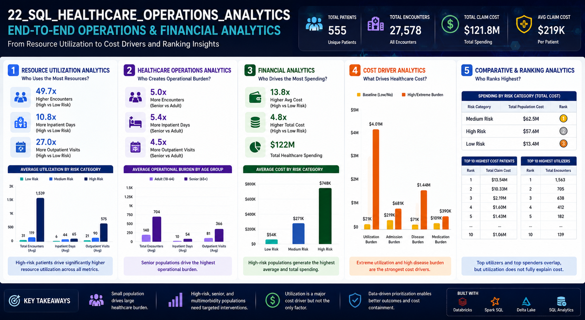

# 22_SQL_Healthcare_Operations_Analytics

End-to-End Healthcare Operations, Resource Utilization, Financial Analytics, and Cost Driver Analysis using SQL on curated healthcare population datasets.

---

# Executive Dashboard



Healthcare analytics pipeline designed to evaluate:

- Resource utilization
- Operational burden
- Financial burden
- Cost drivers
- Population-level rankings
- Healthcare cost concentration

This notebook answers:

> Which patient populations generate the greatest operational and financial burden within healthcare systems?

---

# Key Questions Answered

✓ Who consumes the most healthcare resources?

✓ Which populations create operational burden?

✓ Which populations generate highest healthcare spending?

✓ What factors drive healthcare cost?

✓ Which populations should healthcare systems prioritize?

✓ How do utilization and clinical complexity contribute to financial burden?

---

# Project Overview

Healthcare systems face increasing pressure from:

- Aging populations
- Multimorbidity
- Rising healthcare utilization
- Increasing healthcare cost
- Resource constraints
- Operational burden

This notebook performs population-level analytics to identify:

- high-risk populations
- high-cost populations
- high-utilization populations
- major healthcare cost drivers
- operational burden concentration

Analyses were developed using:

- Spark SQL
- Databricks SQL
- Delta Lake
- Gold Layer Analytics
- Window Functions
- Ranking Analytics

---

# Dataset

Primary Source:

```text
healthcare_catalog.gold.population_health_dashboard
```

Contains:

### Demographics

- patient_id
- age
- gender
- city
- state

### Utilization Metrics

- total encounters
- emergency encounters
- inpatient encounters
- encounter duration

### Clinical Metrics

- chronic disease burden
- risk category
- medication burden
- polypharmacy

### Financial Metrics

- total claim cost
- pharmacy cost
- institutional cost

---

# Notebook Structure

This notebook contains five major analytics domains.

---

# Section 1 — Resource Utilization Analytics

## Objective

Identify populations consuming greatest healthcare resources.

### Topics Covered

- utilization by risk category
- utilization by age
- utilization by multimorbidity
- highest resource consumers

### Outputs Generated

- utilization KPIs
- resource concentration metrics
- dashboard-ready summaries

Documentation:

```text
docs/notebook_22/resource_utilization_analytics.md
```

Visualization:

```text
images/resource_utilization_chart.png
```

---

# Section 2 — Healthcare Operations Analytics

## Objective

Evaluate healthcare operational burden.

### Topics Covered

- emergency burden
- admission burden
- operational workload
- high-burden populations

### Outputs Generated

- workload KPIs
- operational pressure metrics
- healthcare operations insights

Documentation:

```text
docs/notebook_22/healthcare_operations_analytics.md
```

Visualization:

```text
images/healthcare_operations_grouped_bar_chart.png
```

---

# Section 3 — Financial Analytics

## Objective

Evaluate healthcare spending and cost concentration.

### Topics Covered

- cost by risk
- cost by age
- cost by multimorbidity
- highest-cost populations

### Outputs Generated

- spending KPIs
- financial burden metrics
- cost concentration analysis

Documentation:

```text
docs/notebook_22/financial_analytics.md
```

Visualization:

```text
images/financial_cost_by_risk_bar_chart.png
```

---

# Section 4 — Cost Driver Analytics

## Objective

Determine strongest contributors to healthcare spending.

### Cost Drivers Evaluated

- utilization burden
- admission burden
- multimorbidity
- medication burden
- polypharmacy

### Outputs Generated

- cost-driver KPIs
- burden analysis
- financial escalation patterns

Documentation:

```text
docs/notebook_22/cost_driver_analytics.md
```

Visualization:

```text
images/cost_driver_grouped_bar_chart.png
```

---

# Section 5 — Comparative & Ranking Analytics

## Objective

Rank populations generating greatest healthcare burden.

### Topics Covered

- spending rankings
- utilization rankings
- top-cost populations
- comparative burden analysis
- cost vs utilization comparisons

### Outputs Generated

- ranking metrics
- prioritization analytics
- executive dashboard outputs

Documentation:

```text
docs/notebook_22/comparative_ranking_analytics.md
```

Visualization:

```text
images/comparative_spending_rank_bar_chart.png
```

---

# Major Findings

The following insights were identified across the notebook:

---

## Resource Utilization

High-risk populations consume substantially greater healthcare resources.

Observed:

High-risk populations demonstrate elevated:

- encounters
- admissions
- utilization burden

---

## Operational Burden

Operational workload is concentrated among:

- senior populations
- high-risk populations
- multimorbidity populations

---

## Financial Burden

Healthcare spending is disproportionately generated by:

- high-risk populations
- older populations
- complex chronic disease populations

---

## Cost Drivers

Strongest observed cost drivers:

### 1. Extreme Utilization Burden

Approximate average cost:

```text
≈ $4.0M
```

---

### 2. Multimorbidity

Approximate average cost:

```text
≈ $1.44M
```

---

### 3. Admission Burden

Approximate average cost:

```text
≈ $681K
```

---

### 4. Polypharmacy

Approximate average cost:

```text
≈ $390K
```

---

## Ranking Analytics

Healthcare burden is concentrated among:

Older

↓

High-risk

↓

Multimorbidity populations

---

# Executive Insights Generated

This notebook identifies:

✓ High-cost populations

✓ High-utilization populations

✓ Major cost drivers

✓ Operational burden concentration

✓ Population prioritization targets

✓ Resource allocation opportunities

✓ Potential intervention populations

---

# Technologies Used

SQL

Spark SQL

Databricks

Delta Lake

Window Functions

CASE WHEN

GROUP BY

Aggregation Functions

CTE

RANK()

Gold Layer Analytics

---

# Output Artifacts Generated

Notebook outputs include:

✓ Resource utilization KPIs

✓ Operational burden metrics

✓ Financial burden metrics

✓ Cost-driver analytics

✓ Population ranking analytics

✓ Executive dashboard visualizations

✓ Portfolio-ready documentation

---

# Downstream Consumers

Outputs support:

- Executive dashboards
- Population health teams
- Healthcare operations teams
- Cost containment programs
- Predictive modeling pipelines
- Clinical AI models
- Leadership reporting

---

# Repository Structure

```text
22_sql_healthcare_operations_analytics/

│── README.md

│── notebook_22.sql

│── images/
│      dashboard_image.png
│      resource_utilization_chart.png
│      healthcare_operations_grouped_bar_chart.png
│      financial_cost_by_risk_bar_chart.png
│      cost_driver_grouped_bar_chart.png
│      comparative_spending_rank_bar_chart.png

│── docs/notebook_22/
│      resource_utilization_analytics.md
│      healthcare_operations_analytics.md
│      financial_analytics.md
│      cost_driver_analytics.md
│      comparative_ranking_analytics.md
│      notebook_22_summary.md
```

---

# Notebook Summary

Notebook:

```text
22_sql_healthcare_operations_analytics
```

Completed Sections:

✓ Resource Utilization Analytics

✓ Healthcare Operations Analytics

✓ Financial Analytics

✓ Cost Driver Analytics

✓ Comparative & Ranking Analytics

Status:

```text
COMPLETED
```

---

# Final Executive Summary

Healthcare burden is disproportionately generated by small high-risk populations exhibiting:

- elevated utilization
- multimorbidity
- operational burden
- financial burden
- increased treatment complexity

Targeted intervention among these populations may improve:

✓ healthcare efficiency

✓ resource allocation

✓ cost containment

✓ care coordination

✓ population outcomes

---

**Notebook Status: Completed**

`22_sql_healthcare_operations_analytics`
