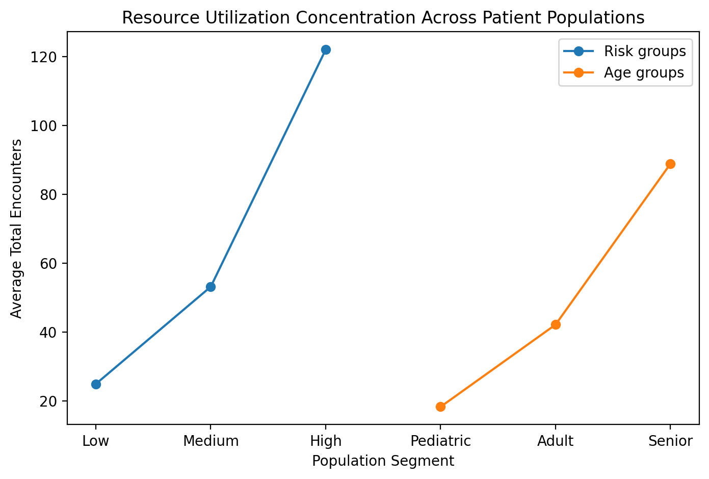

# Resource Utilization Analytics
# Key Utilization Trends

The chart below highlights increasing healthcare utilization among:

- higher-risk populations
- older populations

These findings support observed concentration of operational burden.



Notebook:

`22_sql_healthcare_operations_analytics`

Domain:

Healthcare Operations Analytics

Data Layer:

Gold Layer Analytics

Primary Table:

`healthcare_catalog.gold.population_health_dashboard`

Status:

Completed

---

# Objective

Evaluate healthcare resource consumption patterns across patient populations to identify:

- high-utilization cohorts
- operational burden drivers
- multimorbidity impact
- utilization concentration
- populations requiring targeted intervention

This analysis supports:

- population health management
- hospital operations
- utilization management
- care coordination
- value-based care initiatives

---

# Data Sources

Input Table:

```text
healthcare_catalog.gold.population_health_dashboard
```

Included metrics:

### Demographics

- age
- gender
- location
- marital status

### Utilization Metrics

- total encounters
- emergency encounters
- inpatient encounters
- ambulatory encounters
- encounter duration

### Clinical Metrics

- chronic disease burden
- medication burden
- risk indicators

### Financial Metrics

- claim costs
- pharmacy costs
- institutional costs

---

# Analytical Scope

This section evaluates relationships between:

```text
Risk Category
            ↓
Healthcare Utilization

Age
            ↓
Healthcare Utilization

Chronic Disease Burden
            ↓
Healthcare Utilization

High Utilizers
            ↓
Operational Burden
```

---

# Analysis 1

## Population Health Risk vs Resource Utilization

Objective:

Measure utilization burden across risk categories.

Metrics:

- average encounters
- emergency encounters
- inpatient encounters

### Results

| Risk Category | Avg Encounters | Avg Emergency | Avg Inpatient |
|---------------|---------------:|---------------:|---------------:|
| High Risk | 122.00 | 5.86 | 6.38 |
| Medium Risk | 53.13 | 1.70 | 0.84 |
| Low Risk | 24.87 | 0.73 | 0.05 |

### Key Finding

High-risk populations demonstrate substantially elevated healthcare utilization.

Observed utilization:

```text
High Risk ≈ 5x Low Risk utilization
```

Implication:

Clinical risk concentration contributes significantly to operational burden.

---

# Analysis 2

## Age Group vs Resource Utilization

Objective:

Assess utilization variation across age populations.

Age segmentation:

- Pediatric
- Adult
- Senior

### Results

| Age Group | Avg Encounters | Avg Emergency | Avg Inpatient |
|-----------|---------------:|---------------:|---------------:|
| Senior | 88.84 | 3.13 | 2.94 |
| Adult | 42.10 | 1.61 | 0.87 |
| Pediatric | 18.24 | 0.68 | 0.01 |

### Key Finding

Healthcare utilization increases progressively with age.

Senior populations demonstrate the highest:

- encounter burden
- emergency utilization
- admission burden

Implication:

Aging populations generate elevated operational demand.

---

# Analysis 3

## Chronic Disease Burden vs Resource Utilization

Objective:

Measure impact of multimorbidity on utilization.

### Results Summary

| Chronic Diseases | Avg Encounters |
|-----------------|----------------:|
| 0 | 21.54 |
| 1 | 36.46 |
| 2 | 45.10 |
| 3 | 54.29 |
| 4 | 106.05 |
| 5 | 139.27 |
| 6 | 415.50 |

### Key Finding

Utilization increases sharply with chronic disease burden.

Observed relationship:

```text
Increasing multimorbidity
            ↓
Higher encounters
            ↓
Higher admission burden
            ↓
Greater resource consumption
```

Implication:

Patients with multiple chronic conditions drive healthcare demand.

---

# Analysis 4

## High Utilizer Identification

Objective:

Identify populations generating disproportionate operational burden.

Characteristics observed among highest utilizers:

- advanced age
- elevated risk category
- multimorbidity
- high claims burden

Representative examples:

```text
Patient:
Age = 111
Chronic Diseases = 6
Encounters = 705
Total Claims = $13.5M

Patient:
Age = 97
Chronic Diseases = 4
Encounters = 1563
Total Claims = $2.19M
```

### Key Finding

Healthcare utilization is highly concentrated among a small subset of patients.

Implication:

Operational workload follows utilization concentration patterns.

---

# Operational Insights

Resource utilization is disproportionately driven by:

✓ High-risk populations

✓ Senior populations

✓ Multimorbidity populations

✓ High-cost patients

---

# Potential Operational Interventions

Healthcare systems may target:

- chronic disease management programs
- care coordination initiatives
- preventive outreach
- utilization reduction strategies
- high-risk patient monitoring

---

# Executive Summary

Resource utilization within the population is highly concentrated among older, high-risk, multimorbidity patients.

These cohorts generate elevated:

- encounter burden
- emergency utilization
- inpatient utilization
- operational workload

Targeted intervention strategies may improve:

- healthcare efficiency
- resource allocation
- care delivery
- cost containment

---

# Technologies Used

- Databricks SQL
- Delta Lake
- Spark SQL
- Medallion Architecture
- Gold Layer Analytics

---

# Output Artifacts

Generated KPIs:

- utilization by risk
- utilization by age
- utilization by multimorbidity
- high utilizer identification
- operational burden metrics

Downstream consumers:

- executive dashboards
- healthcare operations reporting
- population health analytics
- predictive modeling pipelines

---

Status:

Resource Utilization Analytics Completed
