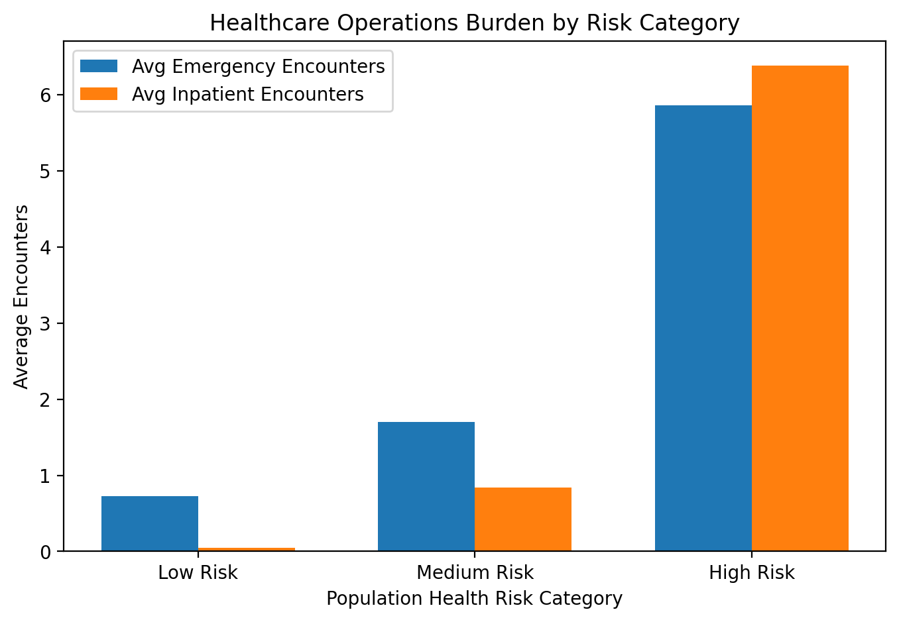

# Healthcare Operations Analytics

Notebook:

`22_sql_healthcare_operations_analytics`

Domain:

Healthcare Operations & Utilization Management

Data Layer:

Gold Layer Analytics

Primary Table:

`healthcare_catalog.gold.population_health_dashboard`

Status:

Completed

---

# Objective

Evaluate operational burden across patient populations to identify:

- emergency utilization patterns
- admission burden
- operational workload drivers
- high-burden patient populations
- hospital resource pressure

This analysis supports:

- hospital operations
- utilization management
- workforce planning
- capacity planning
- population health programs
- care coordination initiatives

---

# Data Sources

Input Table:

```text
healthcare_catalog.gold.population_health_dashboard
```

Included metrics:

### Utilization Metrics

- emergency encounters
- inpatient encounters
- encounter duration
- total encounters

### Clinical Metrics

- chronic disease burden
- population risk category

### Financial Metrics

- claim cost
- institutional spending

### Demographic Metrics

- age
- gender
- location

---

# Analytical Scope

This section evaluates relationships between:

```text
Risk Category
            ↓
Emergency Burden

Age
            ↓
Admission Burden

Chronic Disease Burden
            ↓
Operational Workload

High-Burden Patients
            ↓
Hospital Resource Pressure
```

---

# Analysis 1

## Emergency Department Burden by Risk Category

Objective:

Determine which populations generate greatest emergency workload.

Metrics:

- average emergency encounters
- maximum emergency encounters
- average inpatient encounters

### Results

| Risk Category | Avg Emergency | Max Emergency | Avg Inpatient |
|---------------|---------------:|---------------:|---------------:|
| High Risk | 5.86 | 115 | 6.38 |
| Medium Risk | 1.70 | 9 | 0.84 |
| Low Risk | 0.73 | 3 | 0.05 |

### Key Finding

High-risk populations demonstrate disproportionately greater emergency utilization.

Observed:

```text
High Risk ≈ 8x emergency burden compared to Low Risk
```

Implication:

Clinical risk concentration contributes substantially to emergency department pressure.

---

# Analysis 2

## Admission Burden by Age Group

Objective:

Assess inpatient burden across age populations.

Age groups:

- Pediatric
- Adult
- Senior

### Results

| Age Group | Avg Inpatient | Avg Duration (hrs) |
|-----------|---------------:|-------------------:|
| Senior | 2.94 | 2.90 |
| Adult | 0.87 | 1.92 |
| Pediatric | 0.01 | 0.33 |

### Key Finding

Admission burden increases with age.

Senior populations exhibit:

- higher admissions
- longer encounter durations
- elevated hospital workload

Implication:

Aging populations increase operational demand.

---

# Analysis 3

## Operational Workload by Chronic Disease Burden

Objective:

Evaluate effect of multimorbidity on operational workload.

### Results

| Chronic Diseases | Avg Emergency | Avg Inpatient | Avg Duration |
|-----------------|---------------:|---------------:|--------------:|
| 0 | 0.86 | 0.01 | 0.39 |
| 4 | 2.59 | 4.23 | 2.38 |
| 5 | 11.55 | 3.91 | 5.45 |
| 6 | 15.50 | 20.50 | 4.26 |

### Key Finding

Increasing multimorbidity substantially raises:

- emergency burden
- admission burden
- care complexity

Observed relationship:

```text
Higher disease burden
            ↓
Longer care episodes
            ↓
Greater workload
```

Implication:

Complex patients drive operational pressure.

---

# Analysis 4

## Highest Operational Burden Patients

Objective:

Identify patients generating greatest hospital workload.

Characteristics observed:

- elevated inpatient encounters
- prolonged encounter duration
- advanced age
- multimorbidity
- high claims burden

Representative examples:

```text
Patient:

Age = 99

Inpatient Encounters = 67

Encounter Duration = 14.85 hrs

Total Claims ≈ $1.6M


Patient:

Age = 64

Inpatient Encounters = 57

Encounter Duration = 51.81 hrs

Total Claims ≈ $370K
```

### Key Finding

Operational burden is concentrated among small high-risk populations.

Implication:

Healthcare workload follows concentration patterns.

---

# Operational Insights

Hospital workload is disproportionately driven by:

✓ High-risk populations

✓ Senior populations

✓ Multimorbidity populations

✓ Long-duration encounters

---

# Potential Operational Interventions

Healthcare systems may implement:

- care coordination programs
- chronic disease management
- utilization reduction strategies
- discharge planning optimization
- high-risk monitoring programs

---

# Executive Summary

Healthcare operational burden is highly concentrated among older, high-risk, multimorbidity populations.

These cohorts generate elevated:

- emergency utilization
- admission burden
- prolonged encounters
- staffing demand

Targeted intervention may improve:

- hospital efficiency
- workforce allocation
- care delivery
- operational cost control
---

# Operational Burden by Risk Population

The figure below compares emergency utilization and inpatient burden across population health risk categories.

Higher-risk populations demonstrate substantially greater operational demand.


---


# Technologies Used

- Databricks SQL
- Delta Lake
- Spark SQL
- Gold Layer Analytics
- Medallion Architecture

---

# Output Artifacts

Generated KPIs:

- emergency burden by risk
- admission burden by age
- workload by multimorbidity
- high operational burden populations

Downstream consumers:

- executive dashboards
- operations reporting
- forecasting models
- healthcare planning teams

---

Status:

Healthcare Operations Analytics Completed
