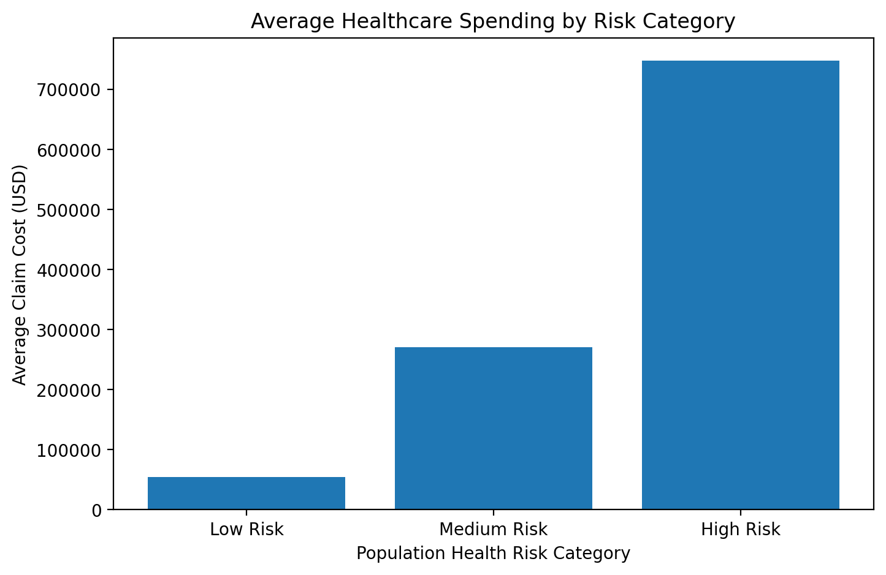

# Financial Analytics

Notebook:

`22_sql_healthcare_operations_analytics`

Domain:

Healthcare Financial Analytics & Cost Management

Data Layer:

Gold Layer Analytics

Primary Table:

`healthcare_catalog.gold.population_health_dashboard`

Status:

Completed

---

# Objective

Evaluate healthcare spending patterns and identify:

- high-cost populations
- financial burden drivers
- cost concentration
- multimorbidity-related spending
- populations generating elevated claims burden

This analysis supports:

- healthcare finance
- payer analytics
- cost containment initiatives
- population health management
- risk-based contracting
- value-based care

---

# Financial Burden Overview

The figure below illustrates average healthcare spending across population health risk categories.

Higher-risk populations demonstrate substantially greater per-patient financial burden.



---

# Data Sources

Input Table:

```text
healthcare_catalog.gold.population_health_dashboard
```

Included metrics:

### Financial Metrics

- total claim cost
- pharmacy cost
- institutional cost
- average claim cost

### Utilization Metrics

- total encounters
- inpatient encounters
- emergency encounters

### Clinical Metrics

- chronic disease burden
- population health risk category

---

# Analytical Scope

This section evaluates relationships between:

```text
Risk Category
            ↓
Healthcare Spending

Age
            ↓
Financial Burden

Chronic Disease Burden
            ↓
Cost Escalation

High-Cost Patients
            ↓
Cost Concentration
```

---

# Analysis 1

## Cost by Risk Category

### Results

| Risk Category | Avg Claim Cost | Total Population Cost |
|---------------|---------------:|-----------------------:|
| High Risk | $748K | $57.6M |
| Medium Risk | $271K | $62.5M |
| Low Risk | $54K | $13.4M |

### Key Finding

High-risk populations exhibit:

~14x higher average spending than low-risk populations.

Implication:

Clinical risk strongly predicts financial burden.

---

# Analysis 2

## Cost by Age Group

### Results

| Age Group | Avg Claim Cost | Total Population Cost |
|-----------|---------------:|-----------------------:|
| Senior | $429K | $58.4M |
| Adult | $218K | $73.8M |
| Pediatric | $16K | $1.3M |

### Key Finding

Senior populations have highest per-patient cost.

Adult populations generate highest aggregate spending.

---

# Analysis 3

## Cost by Chronic Disease Burden

### Key Findings

Observed escalation:

```text
0 diseases
≈ $70K average cost

↓

6 diseases
≈ $6.94M average cost
```

Implication:

Multimorbidity substantially increases healthcare spending.

---

# Analysis 4

## Highest Cost Patient Identification

Representative examples:

```text
Age = 111

Chronic Diseases = 6

Encounters = 705

Total Claims ≈ $13.5M
```

Observed:

Healthcare spending is highly concentrated among small populations.

---

# Financial Insights

Healthcare cost burden is disproportionately driven by:

✓ High-risk populations

✓ Senior populations

✓ Multimorbidity populations

✓ High-utilization patients

---

# Executive Summary

Financial burden within the population is concentrated among older, high-risk, multimorbidity patients exhibiting elevated utilization.

Targeted intervention may improve:

- cost containment
- resource allocation
- care coordination
- population health outcomes

---

# Technologies Used

- Databricks SQL
- Spark SQL
- Delta Lake
- Gold Layer Analytics
- Medallion Architecture

---

# Output Artifacts

Generated KPIs:

- cost by risk
- cost by age
- cost by multimorbidity
- high-cost population identification
- spending concentration metrics

Downstream consumers:

- executive dashboards
- finance reporting
- payer analytics
- predictive models

---

Status:

Financial Analytics Completed
