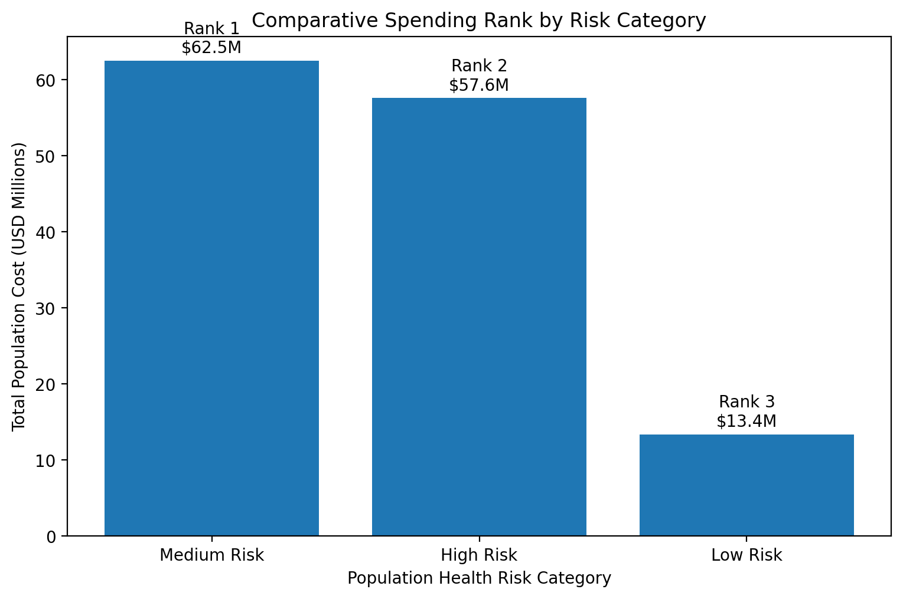

# Comparative and Ranking Analytics

Notebook: `22_sql_healthcare_operations_analytics`

Domain: Healthcare Executive Analytics & Population Prioritization

Data Layer: Gold Layer Analytics

Primary Table: `healthcare_catalog.gold.population_health_dashboard`

Status: Completed

---

# Objective

Compare patient populations and rank high-impact groups based on:

- total spending
- average spending
- utilization burden
- clinical risk
- cost concentration

This section supports executive reporting, population prioritization, and intervention planning.

---

# Comparative Spending Overview

The figure below ranks population health risk groups by total healthcare spending.



---

# Key Findings

## 1. Comparative Spending by Risk Category

| Risk Category | Avg Cost | Total Population Cost | Rank |
|---|---:|---:|---:|
| Medium Risk | $271K | $62.5M | 1 |
| High Risk | $748K | $57.6M | 2 |
| Low Risk | $54K | $13.4M | 3 |

Medium-risk populations generated the highest aggregate spending because of larger population size.

---

## 2. Highest Cost Patients

Top-cost patients were primarily:

- high-risk
- older adults
- multimorbidity patients

Representative top-cost profile:

```text
Age = 111
Risk Category = High Risk
Chronic Diseases = 6
Total Claims ≈ $13.5M
```

---

## 3. Highest Utilization Patients

Top-utilization patients were also concentrated among:

- high-risk populations
- older populations
- patients with multiple chronic diseases

Representative top-utilizer profile:

```text
Age = 97
Risk Category = High Risk
Chronic Diseases = 4
Total Encounters = 1,563
```

---

## 4. Cost Rank vs Utilization Rank

Several patients appeared in both high-cost and high-utilization rankings.

However, utilization did not fully explain cost.

This indicates healthcare spending is influenced by multiple factors:

- utilization burden
- disease burden
- treatment complexity
- medication burden
- risk category

---

# Executive Summary

Comparative ranking analytics identified that:

1. Medium-risk populations generate the highest total spending.
2. High-risk patients dominate top-cost rankings.
3. High-risk patients dominate top-utilization rankings.
4. Utilization is a strong but incomplete predictor of cost.

These findings support targeted intervention strategies for both high-cost individuals and large moderate-risk populations.

---

# Business Use Cases

This analysis supports:

- executive dashboard reporting
- care management prioritization
- high-cost patient monitoring
- utilization reduction programs
- payer population segmentation
- value-based care planning

---

# Technologies Used

- Databricks SQL
- Spark SQL
- Window functions
- `RANK()`
- CTEs
- Delta Lake
- Gold Layer Analytics

---

# Output Artifacts

Generated KPIs:

- spending rank by risk category
- top cost patient ranking
- top utilization patient ranking
- cost rank vs utilization rank comparison

Downstream consumers:

- executive dashboards
- Power BI reports
- population health teams
- predictive modeling pipeline

---

Status: Comparative and Ranking Analytics Completed
