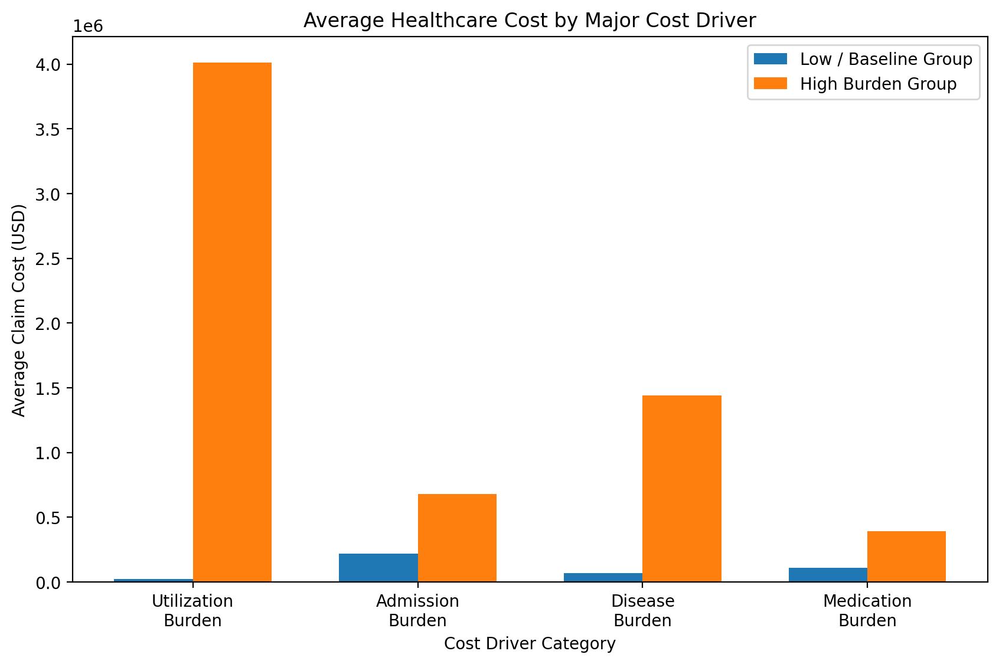

# Cost Driver Analytics

Notebook: `22_sql_healthcare_operations_analytics`

Domain: Healthcare Cost Management & Value-Based Care Analytics

Data Layer: Gold Layer Analytics

Primary Table: `healthcare_catalog.gold.population_health_dashboard`

Status: Completed

---

# Objective

Identify the major factors associated with increased healthcare spending.

This section evaluates whether cost is influenced by:

- utilization burden
- inpatient admission burden
- chronic disease burden
- medication burden

---

# Cost Driver Overview

The chart below compares baseline populations against high-burden populations across major cost-driver categories.

---

# Key Findings

## 1. Utilization Burden

Extreme utilization patients generated the highest average cost.

| Group | Avg Claim Cost |
|---|---:|
| Low Utilization | $20,947 |
| Extreme Utilization | $4,011,646 |

---

## 2. Admission Burden

Higher inpatient burden was associated with increased spending.

| Group | Avg Claim Cost |
|---|---:|
| No Admission | $219,353 |
| High Admission | $680,766 |

---

## 3. Disease Burden

Multimorbidity showed strong cost escalation.

| Group | Avg Claim Cost |
|---|---:|
| No Chronic Disease | $70,504 |
| High Disease Burden | $1,441,672 |

---

## 4. Medication Burden

Polypharmacy populations generated higher average cost.

| Group | Avg Claim Cost |
|---|---:|
| Non-Polypharmacy | $108,528 |
| Polypharmacy | $390,461 |

---

# Executive Summary

The strongest observed cost drivers were:

1. Extreme utilization burden  
2. High chronic disease burden  
3. High admission burden  
4. Polypharmacy  

These findings support targeted cost-containment strategies focused on high-utilization, multimorbidity, and complex medication-burden populations.

---

# Business Use Cases

This analysis supports:

- payer cost management
- hospital financial planning
- value-based care programs
- population health intervention design
- care coordination prioritization

---

# Technologies Used

- Databricks SQL
- Spark SQL
- Delta Lake
- Gold Layer Analytics

---

Status: Cost Driver Analytics Completed
